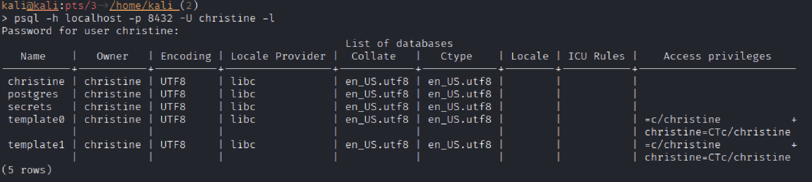
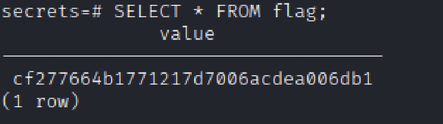

# Hack The Box — [Funnel]
## Security Assessment Report

### Metadata
- **Platform:** Hack The Box
- **Lab Type:** [Starting Point]
- **Operating System:** [Linux]
- **Difficulty:** [Very Easy]
- **Date Completed:** [06/08/25]
- **Author:** [Teal (Dalton Wright)]

---
## 1. Executive Summary
The objective of this engagement was to gain access to the target machine and retrieve the system flag. The attack vector involved exploiting weak credential management (default passwords) and utilizing SSH local port forwarding to bypass network segmentation and access a restricted PostgreSQL database.

## 2. Information Gathering & Initial Access
### 2.1 External Enumeration
A port scan of the target revealed two open TCP ports:
*   Port 21 (FTP): An open FTP server was identified.
*   Port 22 (SSH): An open SSH service was identified.

### 2.2 Data Leakage (FTP)
Upon exploring the FTP server, two critical files were retrieved:
1.  PDF Document: Contained a default password.
2.  Email/Contact List: Indicated that new employees had not yet updated their default passwords.

### 2.3 Credential Stuffing/Password Spraying
Using the default password and the list of usernames identified from the contact list, a password spraying attack was conducted against the SSH service. This resulted in successful authentication as user Christine.

## 3. Internal Enumeration & Pivoting
### 3.1 Service Identification
Once a shell was established, internal enumeration was performed to identify services not exposed to the external network. Using the ```ss -tln``` command, I discovered a service listening on 127.0.0.1:5432. 

*   Observation: The service was bound only to the loopback interface, meaning it was inaccessible from the attack box despite the port being open.

### 3.2 Network Pivoting (SSH Local Port Forwarding)
To bridge the gap between the attack box and the internal loopback service, an SSH tunnel was established.

Command Used: 
```ssh -L 8432:127.0.0.1:5432 christine@10.129.228.195```

Technical Justification: 
I mapped local port 8432 (to avoid a collision with a local Postgres installation) to the target's internal port 5432. This effectively routed traffic from the attack machine through the SSH encrypted tunnel and dropped it directly onto the target's lo interface.

## 4. Data Exfiltration (PostgreSQL)
### 4.1 Tunnel Validation
The tunnel was verified as operational using nc -zv localhost 8432, confirming a successful TCP handshake.

### 4.2 Database Enumeration
Using the psql client on the attack box, I connected to the tunnel to list the available databases:
```psql -h localhost -p 8432 -l```



### 4.3 Flag Retrieval
After identifying the target database [Insert DB Name], I connected to the instance and enumerated the tables using the \dt command. A table named [Insert Table Name] was identified as containing the flag.

Final Query:
```SELECT * FROM [secrets];```


Result: 
Flag: ```cf277664b1771217d7006acdea006db1```


